# QPSK Transceiver

MATLAB implementation of a QPSK digital communication system with full receiver synchronisation pipeline. MSc thesis project.

## Pipeline

```mermaid
graph LR
    subgraph TX
        A[generateBits] --> B[scrambler]
        B --> C[addPreamble]
        C --> D[qpskModulate]
        D --> E[pulseShape TX]
    end

    E --> F

    subgraph CH [channel]
        F[AWGN + frequency offset + timing error]
    end

    F --> G

    subgraph RX
        G[AGC] --> H[pulseShape RX]
        H --> I[coarseFreqSync\nx⁴ estimator]
        I --> J[carrierSync\nDD-PLL]
        J --> K[symbolTiming\nZero-crossing TED WIP]
        K --> L[findPreamble\ncross-corr]
        L --> M[decodeFrame]
        M --> N[descramble]
        N --> O[bits out]
    end
```



## Project structure

```
/
├── config.m               # all system parameters
├── main.m                 # simulation entry point, BER vs SNR sweep
├── transmitter.m          # TX pipeline
├── receiver.m             # RX pipeline
├── channel.m              # AWGN + frequency offset + timing error
├── qpskModulate.m
├── pulseShape.m           # RRC matched filter
├── coarseFreqSync.m       # x⁴ frequency estimator
├── carrierSync.m          # decision-directed PLL
├── findPreamble.m         # cross-correlation frame detector
├── decodeFrame.m          # phase ambiguity resolution + decode
├── scramble_builtin.m
├── generateBits.m
├── symbolTimingSync.m     # Zero-crossing TED (WIP)
└── SupplementaryScripts/  # visualisation functions
```

## Status

| Block | Simulation | USRP |
|---|---|---|
| QPSK mod/demod | ✅ | — |
| RRC filter | ✅ | — |
| Coarse freq sync | ✅ | — |
| Carrier PLL | ✅ | — |
| Frame sync | ✅ | — |
| Symbol timing (Zero-TED) |  WIP | — |
| USRP interface | — |  WIP |
| Multipath channel | — | planned |

## Requirements

- MATLAB R2021b+
- Communications Toolbox

## Usage

```matlab
cfg = config();
main        % for now runs BER vs SNR sweep and plots results
```

## References

1. Rice, M. — *Digital Communications: A Discrete-Time Approach*, 2008
2. MathWorks — system toolbox documentation
3. Stewart, R. W., *Software Defined Radio using MATLAB and Simulink and the RTL-SDR*, 2nd ed., 2015.
